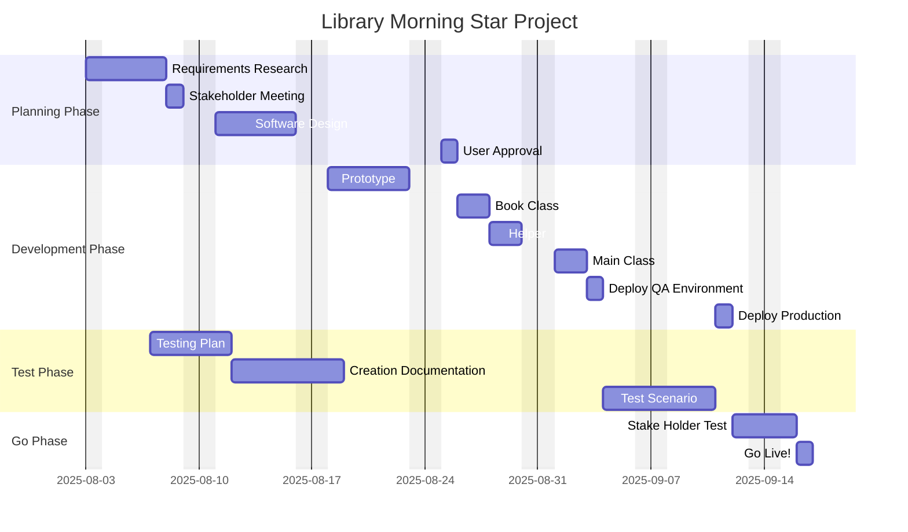

# Assessment_02
This is the book application provided by [Assessment 02](https://ait.instructure.com/courses/5786/assignments/60281) from [AIT School](https://ait.edu.au/).
---
## Project Diagram

Below it is possible to see the diagram with the plan and dising for the Library project using the diagram tool [mermaid](https://mermaid.js.org/syntax/gantt.html):

* 